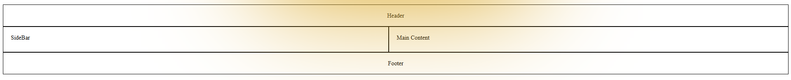
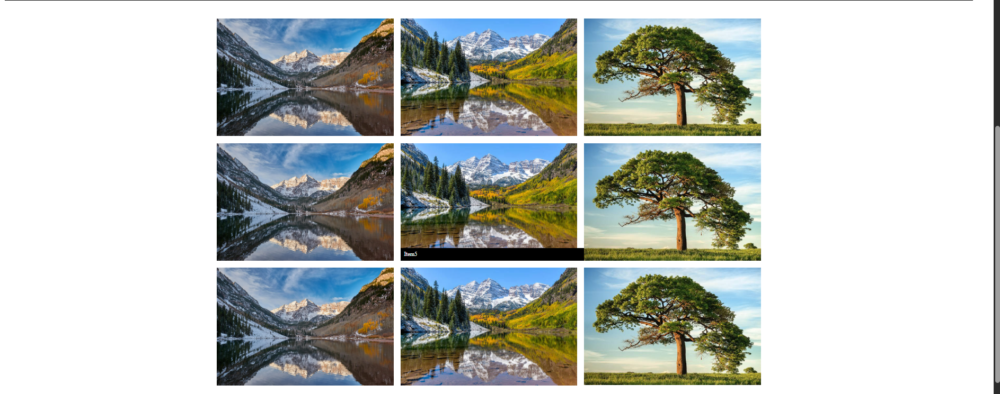
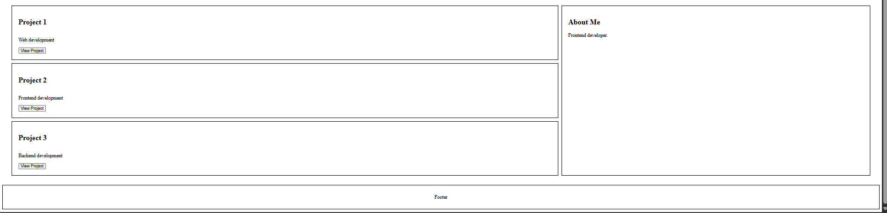

# Assignment 2 - Advanced CSS (Flexbox & Grid)

## Student Information

Name: Korganbek Madiyar
Group: IT-2501

## Objective

The main goal of this assignment was to learn and apply advanced CSS layout techniques using Flexbox and CSS Grid. During this assignment, I worked with navigation bars, card layouts, Grid areas, image galleries and portfolio layouts. I also learned how to combine Flexbox and Grid to create structured and responsive webpages.

# Part 1 - Flexbox

## Step 0 - Navigation Bar

I created a navigation bar using Flexbox. The logo is placed on the left side and the navigation links are placed on the right side. I used `justify-content` and `align-items` to control the position of the elements and `gap` to create spacing between the links.

## Step 1 - Card Row

I created a row of three project cards using Flexbox. Each card contains an image, title, description and button. I used `flex: 1` to make the cards equal in size and added a hover effect using `transform` and `box-shadow`.

# Part 2 - CSS Grid

## Step 2 - Page Layout with Grid Areas

I created a page layout using CSS Grid. The layout contains a header, sidebar, main content and footer. I used `grid-template-columns`, `grid-template-rows` and `grid-template-areas` to organize the page structure.

## Step 3 - Image Gallery

I created an image gallery using CSS Grid with nine images. The images are arranged in equal columns and rows with consistent gaps. I also added a hover effect with captions.

# Part 3 - Combining Flexbox and Grid

## Step 4 - Portfolio Page

I created a portfolio page by combining Flexbox and CSS Grid. Grid is used for the main page structure, while Flexbox is used for the navigation and project cards. The portfolio contains projects, information, a header and a footer.

# Work Process

First, I created the navigation bar using Flexbox and practiced horizontal alignment, spacing and vertical centering. Then I created project cards and added equal sizing and hover effects.

After that, I worked with CSS Grid and created a page layout using Grid Areas. I also created an image gallery with nine images and added a hover caption effect.

Finally, I combined Flexbox and Grid to create a portfolio page. This allowed me to practice using both layout systems together.

# Final Reflection

This assignment helped me understand how Flexbox and CSS Grid can be used to create modern webpage layouts. I learned how to align elements, create equal-sized cards, define Grid Areas and organize content into rows and columns. I also learned how to combine Flexbox and Grid in the same project and add interactive hover effects.

The assignment improved my understanding of CSS layouts and helped me create more structured and responsive webpages.
